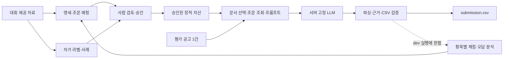

# 구조 설계

상태: **팀 설계**. 루트 `script.py`의 T1 제출 후보와 T2 채점기는 구현했습니다.
T1 실제 모델·서버 제출 성공과 아래 팀용 모듈 분리는 아직 확인하지 않았습니다.
근거: 발표용 9~16장, 로드맵 10~19장. 규칙은 [rules.md](rules.md), 경계 객체는 [contracts.md](contracts.md).

## 1. 준비 공정과 제출 실행



| 경계 | 허용 | 금지 |
| --- | --- | --- |
| 준비 공정 | 제공 자료 가공, 명세 검토, 허용된 자가 라벨 생성, dev 실험 | 외부 데이터 유입, 미확정 외부 API 용도를 허용으로 간주 |
| 승인 경계 | 출처·검토자·버전·품질 결과를 갖춘 자산만 승격 | AI 초안을 자동 승인, 수정 후 옛 승인 유지 |
| 제출 실행 | 제공 모델과 고정 자산을 읽고 공고별 독립 추론 | 외부 API, 평가 자료로 인덱스·규칙 갱신, 다른 공고 정보 재사용 |
| 개발 위키 | 코드 작성·검증·협업 규칙 주입 | 판정용 법령 지식·사례 데이터로 반입 |

공정 반복은 Python CLI와 파일로 시작합니다. 웹 서비스·DB·작업 큐는 필요하지 않습니다.
대량 라벨링은 먼저 dev 기준선과 비용·재시작 방식을 확인한 뒤 확대합니다.

## 2. 파일 소유권과 구현 순서

현재 실행 경로는 루트 `script.py`, `tools/package.py`, `tools/score.py`입니다.
`open/baseline/script.py`는 제공 원본입니다. 아래 `pipeline/`, `specs/` 등 나머지는
**향후 경로**이며 해당 작업을 시작할 때만 만듭니다.

| 오너 | 수정 소유 경로 | 입력 | 출력 |
| --- | --- | --- | --- |
| 통합 | `script.py`, `requirements.txt`, `pipeline/run.py`, `pipeline/output.py`, `tools/package.py` | 공고·프롬프트·고정 모델 | 정상 호출 기록·CSV·제출 ZIP |
| 명세 | `tools/gen_spec.py`, `specs/v01.md`~`v24.md`, `rules/law_map.json` | 항목표·법령 스냅샷 | 7칸 명세·조문 매핑 |
| 라벨 | `tools/gen_label.py`, `labels/`, `cases/` | 제공 공고·검토한 판정 기준 | 라벨·검토 상태·사례 |
| 프롬프트 | `tools/gen_prompt.py`, `prompts/`, `pipeline/input.py`, `pipeline/retrieve.py`, `pipeline/prompt.py` | 승인 명세·매핑·문서 | 토큰 예산 내 메시지 |
| 실험 | `tools/score.py`, `tools/classify_errors.py`, `configs/`, `reports/` | 예측·dev 정답·실행 기록 | 24항목 점수·오답·채택 판단 |

공유 계약 문서와 `AGENTS.md`·`CLAUDE.md`·hook 설정은 통합 담당이 관리합니다.
`pipeline/output.py`의 **판정 보정 규칙**은 명세 오너와 협의합니다. CSV 형식 처리는 통합 책임입니다.
광범위한 `pipeline/` 소유권을 통합 담당에게 중복 부여하지 않고 위 파일 단위로 나눕니다.
담당자의 실명은 팀이 배정하기 전까지 쓰지 않습니다.

## 3. 제출 실행 계약

| 단계 | 책임 | 검증 |
| --- | --- | --- |
| `script.py` | 환경변수·인자 해석, `__main__`에서 시작 | 서버 기본 명령 `python script.py` 실행 |
| `pipeline/input.py` | 원본 보존, 메타·관측성 유지, 공고문과 관련 첨부 선택 | 실제 토크나이저로 전체 메시지 예산 확인 |
| `pipeline/retrieve.py` | 항목→조문 직접 매핑, 국가/지방 분기, 중복 제거 | 조문 ID·원본 위치 보존. 프롬프트 문구 생성하지 않음 |
| `pipeline/prompt.py` | 승인 지시문·조문·공고를 메시지로 조합 | 출력 24항목·근거 규약, 데이터 영역 명확화 |
| `pipeline/run.py` | 고정 LLM 초기화·제약 디코딩·배치·공고별 성공 추적 | 최소 1회 정상 호출, JSON 결손·시간·메모리 기록 |
| `pipeline/output.py` | JSON 파싱, e 검증, 49열 CSV 저장·재검사 | D4 계약, 실패 시 비정상 종료·후보 승격 금지 |

기존 베이스라인의 함수와 스키마를 먼저 재사용하고, 팀 작업이 시작되는 경계부터 분리합니다.
초기 제출을 위해 전체 구조를 한꺼번에 리팩터링하지 않습니다.

### 공고별 독립성

- 배치 추론은 가능하나 공고마다 별도의 메시지·결과를 가집니다.
- 제공 법령 인덱스·승인 사례집·설정은 읽기 전용으로 공유할 수 있습니다.
- 평가 공고의 텍스트·예측·통계로 전역 상태를 갱신하지 않습니다.
- 동일 공고 내부의 분할 추론·종합만 허용합니다. 초기 팀 설계는 비용상 공고당 1회입니다.
- 1회는 팀의 시작 전략이고 대회 규칙 R4는 1회 **이상**입니다.

### 실패 처리

- 배치 오류는 실패한 공고 단위로 제한된 재시도 후 명시적 실패를 남깁니다.
- 모델 정상 호출 실패와 JSON 파싱 실패를 구분합니다. 빈 응답을 0으로 채웠다고 R4 충족이 되지 않습니다.
- 파싱·형식 결손은 후보의 품질 게이트에서 드러나야 합니다. 조용한 all-zero 대체로 성공 처리하지 않습니다.
- 잘못된 근거는 원문 대조 후 빈칸으로 처리하고 폐기 수를 기록합니다. 원문에 없는 문장을 만들지 않습니다.
- 예산을 더 줄일 수 없는데 초과하면 실패로 기록합니다. 최소 글자 수에 도달했다는 이유로 초과 메시지를 보내지 않습니다.

## 4. 개선 우선순위

| 순서 | 변경 | 채택 증거 |
| --- | --- | --- |
| 0 | 제공 베이스라인 실행·실제 모델 기준선·제출 성공 | 형식 검사 + live 기록 + 서버 결과 |
| 1 | 항목표의 조문 매핑 직접 주입 | 항목별 F1·조문 포함률, 토큰·총시간 비교 |
| 2 | 관련 첨부 보존·문서 예산, 조건·예외·정보 부족 지시문 | 절단으로 놓친 근거 감소, dev 회귀 점검 |
| 3 | 항목 키워드 BM25, 국가/지방 필터·중복 제거 | 동일 dev·환경에서 이전 후보보다 유리 |
| 4 | 제공 bge-m3와 BM25 혼합 검색 | 위 단계의 한계가 측정되고 점수 개선·시간·메모리 모두 통과 |

새 임베딩 모델·추가 분류기는 도입하지 않습니다. 벡터 DB 서버도 초기 설계에 없습니다.
필요하면 승인된 정적 인덱스 파일로 시작합니다.

## 5. 패키징

첫 후보는 배포 `script.py`와 `requirements.txt`로 최소 제출을 재현합니다.
모듈화 후에는 아래 **allowlist**에서 실제 참조하는 파일만 ZIP 루트에 담습니다.

```text
script.py
requirements.txt
pipeline/          # 추론에 필요한 Python 모듈
prompts/           # 승인된 지시문
specs/             # 추론이 실제로 읽는 승인본만
rules/             # 승인 조문 매핑
model/             # 필요한 정적 검색 자산만
```

`tools/`, `labels/` 원시 생성 결과, `reports/`, `open/` 전체, `.wiki/`, `.claude/`, `.codex/`,
`.env`, 모델 가중치는 무조건 전체 복사하는 대상이 아닙니다.
제공 자료에서 만든 자가 라벨 사례집은 A2·A6의 허용 범위에서 활용합니다.
패키지에는 품질 검토·출처 기록을 갖춘 정적 사례집만 선택하며, 평가 데이터로 사례집을 갱신하지 않습니다.
2차 평가용 생성 코드·라벨 기록은 별도 재현 자료로 보관합니다.

서버 입력·출력은 `PPS_DATA_DIR`, `PPS_OUTPUT_DIR`, 모델은 `PPS_MODEL_DIR`,
임베딩 사용 시 `PPS_EMBED_DIR`를 따릅니다. 로컬 기본값만으로 서버 경로를 가정하지 않습니다.
ZIP 루트·용량·현재 고정 패키지·실행 제한은 실제 제출 전 공식 평가 탭과 대조합니다.
