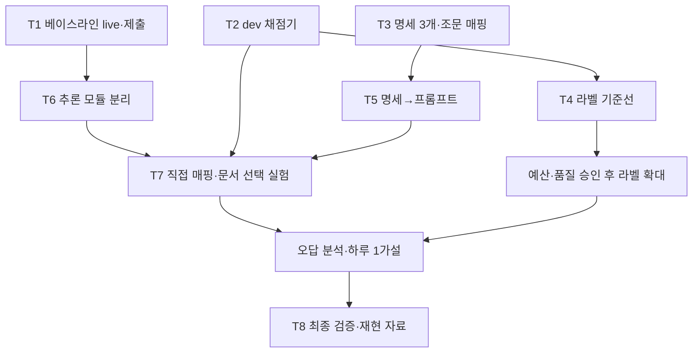

# 실행 로드맵

목표: 하루 최대 1회 제출 기회를 유효한 개선에 사용합니다.
발표용 16·18장의 실행안을 2026-09-16 현재 작업으로 구체화했습니다.
단계별 기간은 팀 계획입니다. 운영 마감은 2026-09-16
[공식 일정](https://dacon.io/competitions/official/236754/overview/schedule)에서 확인했습니다.
팀 병합은 9/23 23:59, 리더보드 제출은 9/29 10:00, 대회 종료는 9/30 10:00입니다.

## 단계

| # | 기간 | 산출물 | 완료 조건 | 상태 |
| --- | --- | --- | --- | --- |
| P0 | 9/16 | 공통 규칙·설계·hooks | 두 AI 진입점·계약·설치 검사; 호스트 hook 신뢰/실행은 별도 확인 | 작성·설치 검사 완료; 호스트 활성화 확인 대기 |
| P1 | 9/16~9/17 | 첫 유효 제출, dev 채점기·기준선 | mock 형식 검사와 live 실행 구분; 서버 점수 1건 | 완료. `654c556` 채점 0.2197036943, 이어 `57761ff` 채점 0.2978624361 ([제출 장부](../reports/submissions.json)). 앞선 `5506ca0` 실패의 원인은 미확정 |
| P2 | 9/18~9/21 | 명세 24개·매핑·라벨 파일럿·지시문 | 3항목 파일럿 승인 후 확대; dev 라벨 기준선·예산 통과 후 대량 실행 | 부분·정체. `specs/`·`rules/law_map.json`은 없다. 라벨은 dev 33건(`reports/label-compare/opus5-cover3`)에서 멈췄고 무라벨 20,000건에는 한 건도 안 붙였다. 무라벨은 지금 발화율 카나리로만 쓰고 있다 |
| P3 | 9/22~9/25 | 하루 1개 가설 실험 | 오답→약한 항목→명세/프롬프트 수정→동일 조건 비교 | 진행 중 (일정보다 앞당겨 9/18 시작). B1~B4 후처리 채택, N1·N3 회차 실측·판정, A2 경쟁제품 규칙 채택. N2는 배선만 있고 미실행 |
| P4 | 9/26~9/28 | 최종 후보·재현 자료 | 새 기능 중단, live 전체 시간 여유·근거·패키지 검사, 검증본 보관 | 미착수 |
| P5 | 9/29 오전 | 제출 상태 확인 | 검증된 버전 유지; 대기열 고려, 새 시도 안 함 | 미착수 |

2026-09-20 현재 위치. 서버 0.2978624361, dev 0.3719775476(`57761ff`).
P2를 채우지 않은 채 P3로 넘어갔다. 명세 24개를 안 쓴 대가가 0점 8항목으로 나타난다 —
v10·v11·v12·v14·v15·v16·v18·v20이 F1=0이고 dev 양성 51건을 버린다. 그래서 남은 일정은
P2의 미완성분 중 점수에 닿는 것만 골라 P3 안에서 처리한다: 항목군별 결정표
([a1-company-size](tasks/a1-company-size.md), [A2 보고](../reports/team-c/a2-competitive-product/README.md)).
전 항목 명세 문서화는 2차 평가 준비로 미룬다.
남은 제출은 9/29 10:00까지 하루 1회, 오늘 포함 약 10회다. 9/19 기회는 쓰지 않았다.

P1은 공정 자동화 완성을 기다리지 않습니다. 라벨·명세 공정은 첫 제출과 병행 준비합니다.
사용자 우선순위: 팀원 합류 전에 오늘 첫 베이스라인을 제출합니다. 규칙·환경 온보딩은 지금,
코드 분담은 첫 유효 제출 기준 커밋과 공통 실행·채점법을 확보한 직후 시작합니다.
내일부터 문서 선택·프롬프트/검색·명세·실험/출력 검증을 나누는 것이 목표이며,
T6의 기계적 모듈 분리는 첫 서버 기준선 뒤 동작을 유지하며 진행합니다.
인원별 구체적 작업은 [tasks.md](tasks.md)에 있습니다.

## 의존 관계

## 채택 판단

| 질문 | 통과 기준 |
| --- | --- |
| 유효한가 | [제출 게이트](rules.md#제출-전-게이트) 통과 |
| 무엇이 좋아졌는가 | 동일 조건 baseline 대비 Macro F1·항목별 오답·근거 품질 변화 |
| 드문 항목을 놓치지 않는가 | 24항목별 결과와 support 확인, 전체 accuracy만으로 승격 금지 |
| 과적합 아닌가 | 조문·공통 실패 원인으로 설명, 검증 ID를 사례에 사용했는지 기록 |
| 시간 내 실행되는가 | 로드·전처리·검색·생성·출력 포함 총시간 실측. 7,200/1,853≈3.89초는 단순 평균 계산일 뿐 |
| 유지할 수 있는가 | 코드·자산·입력·환경·프롬프트를 추적하고 이전 검증본으로 복귀 가능 |

라벨 검토의 상/중/하 등급 임계값과 표본 수 N은 미정입니다.
T4 결과의 항목별 precision·recall·support를 보고 오너가 정합니다. 양성이 드문 데이터에서 accuracy만으로 정하지 않습니다.

## 담당자가 정할 사항

| 결정 | 영향 | 결정 전 가능한 일 |
| --- | --- | --- |
| 5개 역할의 실제 담당자·투입 시간 | 작업 배정 | 역할별 요청서 준비 |
| GPU/서버 접근·로컬 실행 범위 | live 기준선·시간 측정 | mock·채점기·계약 검사 |
| API 모델·예산 상한·키 관리 | T4 및 대량 라벨링 | 입력·프롬프트·manifest 준비 |
| R6의 확장 범위에 대한 운영진 답변 | 명세·프롬프트 등의 외부 API 자동화 | 제공 자료 수동 검토·결정적 변환 |
| 서버 결과·실행 시간·오류 기록 | 다음 제출 후보·팀 분담 | 운영 시각·사양은 공식 확인 완료; T1 결과 수신 후 갱신 |

PPTX 기록: 팀 병합 9/23, 리더보드 9/29, 종료 9/30, 2차 자료 10/5,
결과 10/16, 시상식 예정 11/27. 제출 담당자가 공식 일정의 시각까지 재확인합니다.
