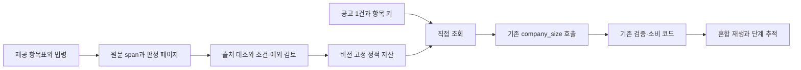

# Wiki RAG 파일럿 — 판정 페이지가 사실 추출을 개선하는가

작업 ID: `wiki-rag-pilot`. 상태: **done / 두 회차 완료, 가설 기각, 세 군 모두 미채택**.
실제 결과·셀 단위 감사·채택 판단은 [results.md](../../reports/wiki-rag-pilot/results.md),
구현 범위와 실행 전 준비 기록은 [준비 상태](../../reports/wiki-rag-pilot/README.md),
자산 검토는 [자산 검토](../../reports/wiki-rag-pilot/assets-review.md),
실행 절차는 [실행 안내](../../reports/wiki-rag-pilot/run-request.md)가 소유한다.
아래 §1~§6은 원래 설계이며 결과가 나와도 조건을 사후에 낮추지 않는다.
2026-09-21 사용자 배정: **Codex는 설계, Claude는 구현**. 추가 에이전트 생성 지시가 아니다.
브랜치: `feat/wiki-rag-pilot`, 분기점 `8afae99c31b2ee4a10b73d4a34ed4f9a1ec3d45e`.
현재 체크아웃에서 분기했으며 최신 원격 main과의 동기화를 주장하지 않는다.
구현자는 이 문서에 따라 실험 후보·CPU 검증·Colab 실행 준비를 진행한다.
운영 채택·커밋·push·PR·머지·대회 제출 권한을 과거 A5 작업에서 가져오지 않는다.

## 1. 목표와 범위

가설: 제공 근거를 적용 대상·관측할 사실·예외별로 묶은 판정 페이지를 기존 company_size
호출에 전달하면 v20의 사실 추출과 최종 TP/FP/FN이 개선되는가?
첫 비교는 **기존 프롬프트 / 원문 조회 / 위키 페이지 조회**다. 원문군이 실패해도
페이지군을 생략하지 않는다. v20 결과만으로 다른 항목이나 RAG 전체를 채택·기각하지 않는다.

- 입력: `open/dev.jsonl` 200건, 채점 전용 `open/dev_labels.csv`, `open/data/항목표.json`,
  제공 법령·고시, 분기점의 `script.py`, H4 보관 baseline/SME 응답.
- 출력: 검증 가능한 v20 페이지·출처 목록, 세 군 파일럿과 검사, 고정 실행 안내,
  이후 원응답·단계 추적·24항목 지표·시간·반복 결과.
- Codex 수정 범위: 이 설계서, `docs/tasks.md`, `docs/README.md`, `.wiki/plan-active.md`.
- Claude 수정 범위와 검증: §7~8. 운영 `script.py`와 원본 자료는 수정하지 않는다.
- 설계 통과 조건: 현재 소비 경로와 연결됨, 세 군의 차이·입력 예산·실패 처리가 명시됨,
  링크·UTF-8 without BOM·LF·diff 검사 통과. 실제 성능 통과와 구분한다.

시작할 때 `git status`, `docs/workflow.md`, `docs/README.md`, `docs/rules.md`,
`docs/items.md` v20, `docs/contracts.md` C1~C5를 확인한다. 기존 미추적 PPTX는 보존한다.
Ponytail 원칙으로 기존 실행기·채점기·재생기를 재사용한다. DB·서버·임베딩 모델·
24개 빈 페이지·자동 위키 생성 서비스는 이번 파일럿에 필요하지 않다.

## 2. 규칙과 자산 생성 경계

개발/로컬 검증: A1·A6·A9·A10, R1~R12 중 해당 조건 및 R15·R18~R22를 유지한다.
추후 자가 라벨 사례집은 A2·A3의 별도 공정이다. 제공 자료만 사용하고 생성 출처를 남긴다.
외부 LLM의 법령 해설·명세 자동 생성은 R6/Q1 미확정이다. 구현 담당이 Claude라는 사실을
그 공정의 허용 근거로 사용하지 않는다. 이번 페이지는 **원문 발췌와 결정적 배치**로 만들고,
새 법적 해석을 외부 API로 생성해 반입하지 않는다. 코드 작성과 판정 지식 생성은 구분한다.
모델 작성 해설을 사용하는 후속 실험은 Q1 확인 및 별도 버전으로 분리한다.

페이지는 공용 코딩 위키 또는 이 저장소 `.wiki/`의 산문을 판정 자료로 복사하지 않는다.
`docs/`·보고서는 설계 참고이며, 법적 주장마다 제공 원문으로 출처를 연결한다.
평가 공고를 이용한 페이지·검색 인덱스 갱신은 금지한다. 승인 상태는 C1을 따르며
실제 사람 검토 없이 `approved`나 검토자 이름을 만들지 않는다. draft는 준비·검증 대상으로
표시하고, 추론에 사용할 자산의 승인 증거를 실행 안내에 명시한다.

## 3. 최소 구조와 페이지 계약

첫 조회 키는 `v20`이다. 국가/지방 공통 근거라는 항목표 정의를 보존한다. 모델이 먼저
SW 사업이라고 판단한 공고에만 페이지를 주지 않는다. 그 선택이 FN을 차단할 수 있으므로
dev 200건 모두에 같은 페이지를 제공한다. 다른 항목까지 항상 주입하지 않는다.

페이지 형식은 C3의 7칸을 재사용한다: 적용 대상 / 필요한 사실 / 위반 조건 / 예외 /
정보 부족 시 / 근거 위치 / 사례. 이번 사례 칸은 비워 두고 미사용이라고 적는다.
dev 정답·ID·오답별 처방을 페이지에 넣지 않는다. 페이지의 법령 인용은 제출 e열이 아니다.
v20의 e열은 판정과 무관하게 빈칸이다.

각 원문 조각은 `source_path`, 원본 SHA256, 조·항·호/별표 주소, `start`, `end`, `quote`를
가진다. 오프셋은 원본을 UTF-8로 디코딩한 문자열의 Python 문자 인덱스, end 제외로 고정한다.
줄바꿈 자동 변환·NFC 정규화 여부로 좌표가 달라지지 않도록 읽기 방법도 manifest에 적는다.
검사는 `source[start:end] == quote`와 source hash를 모두 확인한다. 추적용 주소를 꾸며내지 않는다.

첫 출처 후보:

- `open/data/법령패키지/법령/소프트웨어 진흥법.txt`: 제2조의 SW 사업 정의,
  연결되는 제48조의 참여 지원·예외 범위.
- `open/data/법령패키지/법령/중소 소프트웨어사업자의 사업 참여 지원에 관한 지침.txt`:
  제2조, 제3조(특히 제2항의 명시 장소), 별표 1 및 필요한 예외 연결.
- 예외·다른 조항으로 이어지는 참조는 출처 목록에 남긴다. 필요한 조건을 누락한 채
  표 하나로 v20의 모든 판정 기준을 대표한다고 선언하지 않는다.

정확한 span 집합은 구현 전 원문 검토로 고정한다. 경계 금액의 이상/미만, 사업금액 정의,
분리발주·장기계속계약, 적용 제외와 명시 의무를 혼동하지 않는지 확인한다.
문자열 일치 검사는 인용의 진위만 보장한다. 조건·예외·AND/OR·참조 누락은 별도 검토 대상이다.
알 수 없는 해석은 미확정으로 남긴다. 새 해석을 점수가 오르는 방향으로 채우지 않는다.

## 4. 세 군과 현재 소비 경로

| 군 | 변경 | 유지 |
| --- | --- | --- |
| A `control` | 없음 | 분기점 company 프롬프트·스키마·판정 코드 |
| B `raw` | 고정 span들을 원문 순서로 조회해 추가 | A의 호출 수·스키마·소비자 |
| C `wiki` | B와 같은 span 집합을 7칸 페이지로 묶어 조회해 추가 | B의 법적 사실·호출 수·스키마·소비자 |

B와 C는 출처 주소와 인용 내용의 집합이 같다. C의 차이는 제목·배치·기존 추출 필드와의
연결이다. 인용문 요약·조건 삭제·새 사례 추가는 하지 않는다. 따라서 첫 실험은 **표현 구조의
효과**이며 LLM 증류나 압축 효과 실험은 아니다. 추가 지시는 영어, 법적 용어·인용은 한국어다.
공통 기존 프롬프트는 손대지 않고 별도 데이터 블록을 덧붙인다. 법령을 공고 인용으로 사용 금지한다.

현재 `script.py`의 `COMPANY_SIZE_PROMPT → verify_company_size → verify_document_requirements`
경로에서 v20이 소비하는 것은 `software_business`, `software_business_quote`,
`software_participation_quote`, `requirements_complete`와 실제 공고/RFP 관측 상태다.
검증된 참여 조항 인용이 있으면 0, 적용 대상이고 완전관측인데 인용이 null이면 1을 쓴다.
요건을 못 갖추면 기존 baseline 값을 보존한다. 금액별 참여 제한의 옳고 그름을 새로 판정하는
출력 필드나 결정표는 이번 실험에서 추가하지 않는다.

따라서 페이지가 기존 네 필드와 인용 품질을 바꾸는지 먼저 본다. 별표만 넣어서 소비되지
않는 금액 추론을 기대하지 않는다. 필요하다면 금액별 적정성 판정은 별도 가설로 설계한다.
[A5 독립 분석](../../reports/team-c/a5-label-definition/five-stuck-analysis.md)의 v20 FN 중
3건은 제안요청서 탈락·불완전관측에서 막혔다. 위키로 누락 문서를 복구했다고 주장하지 않는다.

기존 company 응답 전체를 교체하므로 다른 항목도 바뀔 수 있다. 실제 후보의 최종 CSV에는
후보가 낸 모든 기존 필드를 정상 소비한다. 다른 항목을 control 응답으로 덮어 회귀를 숨기지 않는다.
v18 재검토·H2 소비자·A4 게이트는 켜지 않는다.

## 5. 입력 예산과 실행 계획

1. 실제 고정 Gemma 토크나이저로 각 군의 공고별 `max_chars`를 계산한 뒤, 세 군 모두
   예산을 통과하는 공통 `max_chars`를 고정한다. 기존 `fit_to_budget`를 이용한 각 군 값의
   최솟값에서 시작해 실제 메시지로 재확인한다. 토큰 수가 문자 수에 단조 비례한다고 가정하지 않는다.
   세 군은 **동일한 공고 본문·메타·고시 목록**을 사용하고 지식 블록만 바꾼다.
   `조항호내용` 제외 정책, 입력 문서 목록·누락 표시는 그대로다.
2. 통상 A의 입력과 공통 입력의 차이도 ID별로 기록한다. 더 잘린 공고 수·본문 hash·
   관측 가능성 변화를 숨기지 않는다. 이 A는 기존 프롬프트의 **공통 입력 대조군**이며,
   운영 A와 완전히 같은 메시지라고 주장하지 않는다. 군별로 서로 다른 본문을 주거나
   법령 예외만 삭제해 예산을 맞추지 않는다. 최소 본문 예산에서도 초과하면 추론 전에 실패한다.
   실제 후보의 통상 입력·시간·성능은 이후 전체 파이프라인 검증에서 다시 잰다.
3. CPU 배선·출처 검사 후 dev 200건 세 군을 실행한다. 회차1 A→B→C, 회차2 C→B→A.
   같은 코드·자산·입력·설정 ZIP을 새 동일 GPU 환경에서 반복한다. 역순은 순서 영향 완화이며
   완전한 통계적 통제라는 뜻이 아니다. 계획 호출은 1,200건의 company 호출이며 재시도는 별도다.
4. 실제 Colab은 준비된 사용자의 런타임에서 실행한다. 이번 설계 세션은 GPU나 유료 API를
   실행하지 않는다. 노트북 준비를 실제 모델 성공으로 표시하지 않는다.
5. GPU 환경·vLLM·모델/revision·chat template·seed·출력/입력 예산·프롬프트/스키마/자산 hash,
   소스 commit와 변경 파일 hash를 보존한다. 회차2는 회차1과의 계약·환경 일치를 확인한다.
6. 실패·시간 초과에서도 부분 원응답과 events를 보존한다. 미완료를 0으로 채워 채점하지 않는다.
   회차1 불완전 또는 시간 경계 초과이면 회차2를 진행하지 않는다. 기존 결과를 덮어쓰지 않는다.

시간 계획은 기존 A5의 정의를 재사용한다. 기준 서버 6,380초, company 246.985초,
환산계수 `(1853 / 200) × 0.96 = 8.8944`, 단계 상한 **339.177840초/200건**이다.
조건부 서버 총초는 `6380 + (후보 단계초 - 246.985) × 8.8944`다. 모델 적재·공통 준비는
분리 기록하고 최종 전체 실행에서 합산한다. 세 군 실험 총시간을 제출 한 군의 시간과 혼동하지 않는다.
새 장비의 시간 차이를 코드 효과로 읽지 않으며, 이 추정은 서버 성공 증거가 아니다.

## 6. 측정과 채택 판단

H4 `reports/runs/colab-1789902969401579900/dev-debug`의 baseline/SME 원응답을 고정하고
company 응답만 이번 실제 응답으로 교체한다. 비교 기준은 **같은 구현 코드로 새로 측정한 A**다.
과거 0.593846이나 전체 GPU 최고 0.599316을 새 후보의 직접 대조군으로 쓰지 않는다.
점수 이름은 `company GPU + 보관 baseline/SME 혼합 재생`으로 명시한다.

필수 결과:

- 군별 24항목 TP/FP/FN·precision·recall·F1와 Macro F1, A↔B/A↔C/B↔C 변경 셀·ID.
- 각 군 회차1↔회차2 churn. 과거 코드의 Macro 변동 최댓값을 새 허용선으로 쓰지 않는다.
- v20 모든 공고의 원사실, 인용 검증, 실제 문서 관측 상태, consumer의 쓰기/보류,
  baseline 보존 여부, 후처리 후 최종값. company의 공통 reason만으로 v20 원인을 분류하지 않는다.
- 바뀐 v20 판정과 새 FP/FN의 원문 감사. 원문이 달라졌는지, 사실이 달라졌는지,
  사실은 변했지만 검증/소비에 막혔는지 구분한다.
- 추가 입력 토큰·문서 hash·단계 시간·조건부 서버 시간·실패/재시도·최종 유효 응답 수.

두 회차 모두 v20 F1이 A보다 높고 TP가 줄지 않으며, 같은 원인으로 설명 가능한 개선이
반복되어야 다음 검증 후보로 올린다. 다른 항목의 반복 손실이 있으면 운영 채택을 보류한다.
단일 회차나 Macro 상승만으로 승격하지 않는다. 개선이 없으면 입력 도달/관측/소비 실패를
구분해 이번 가설을 기록하고, 위키 전체의 실패로 확대하지 않는다.

B가 C와 동등하거나 더 좋으면 더 단순한 원문 조회를 우선한다. C를 택하는 근거는 반복된
품질 개선 또는 같은 품질에서 확인한 운영상 이점이어야 한다. 단순히 위키가 있다는 이유는 아니다.

유망 후보는 페이지를 먼저 동결한 뒤 무라벨 6,000건(파일 순서의 앞 6,000 ID와 hash 고정)에
A/후보를 적용해 발화율·dev 대비 배율·입력 분포를 비교한다. 필요하면 기존 1,000건 샤드
수집·재개를 재사용한다. 무라벨에는 정답이 없으므로 정확도 검증이라고 하지 않는다.
이후 전체 파이프라인 GPU 반복·총시간·출력 검증을 거쳐 운영 채택을 따로 결정한다.
자가 라벨 사례집, 공고 내부 검색, v18 등 다른 항목 확장은 각각 다음 실험이며 이번에 구현하지 않는다.

## 7. Claude 구현 범위와 재사용

| 경로 | 할 일 |
| --- | --- |
| `experiments/wiki_rag_pilot.py` (신규) | v20 직접 조회, 세 군 프롬프트 구성, 동일 본문 예산 검사, 파일럿 진입점·추적 |
| `experiments/wiki-rag/v20.md`, `sources.json` (신규) | 판정 페이지와 정확한 span/hash·상태; B/C를 같은 출처 집합에서 구성 |
| `experiments/a5_collect_facts.py`, `experiments/a5_scope_pilot.py` | 필요한 경우에만 기존 함수에 작은 확장. 과거 H3/v18 의미·CLI·기본 동작 보존 |
| `tests/test_wiki_rag_pilot.py` (신규) 및 변경 함수의 기존 검사 | 아래 계약 검증. 의미 없는 구현 모사 검사는 만들지 않음 |
| `notebooks/colab-wiki-rag-pilot.ipynb` (신규) | 기존 v18 노트북의 고정 소스·Drive·회차·실패 보존 흐름 재사용 |
| `reports/wiki-rag-pilot/` (신규) | 자산 검토·CPU 결과·inputs/manifest·실행 안내·향후 회차 결과 |
| 이 작업서, `docs/tasks.md`, `docs/README.md`, `.wiki/plan-active.md` | 실제 상태와 결과 링크 갱신 |

새 이름은 허용 경로이지 빈 파일을 전부 만들라는 지시가 아니다. 별도 검색 프레임워크나
채점기·응답 복구를 복제하지 않는다. `script.build_messages/fit_to_budget/run_chunk`,
`tools/replay_run.py`, `tools/score.py`, `tools/compare_runs.py`를 재사용한다.
기존 collector는 군마다 독립적으로 본문을 줄이므로 그대로 세 번 부르는 것만으로 §5를
충족하지 못한다. 고정 본문 계획을 전달하는 최소 확장을 사용한다.
기존 `hybrid_replay`의 H2/ON 분기를 그대로 사용하지 말고 기본 verifier만 쓰는 경로를 재사용한다.
출력 위치·run ID·입력 manifest는 새 실험 것으로 분리한다.

## 8. 통과 조건과 인계 완료점

CPU에서 다음을 확인한다. stub/mock 결과는 실제 모델 성능이 아니다.

1. A 프롬프트·스키마는 분기점과 동일하고, 같은 공통 `max_chars`로 만든 기존 메시지와
   바이트 동일. 통상 입력과의 차이는 별도 기록. 과거 H4 응답의 HEAD 재생 CSV 바이트 동일.
2. B/C 출처 집합 동일. 손상된 hash·offset·인용, 누락 자산·조회 키는 실행 전에 실패한다.
   공고 인용 자리에 법령 인용을 반환하면 기존 검증이 거부한다.
3. 세 군의 공고 본문 hash 동일, 공통 예산 계획으로도 초과 시 추론 호출 0회,
   통상 A 대비 추가 절단 기록, unknown·불완전관측 보호 유지.
4. 동일 facts를 세 군 소비자에 넣으면 결과 동일. 소비 코드는 바뀌지 않는다.
   실제 관측된 v20 변화가 verifier와 최종 CSV까지 이어지는 작은 배선 사례를 검사한다.
5. 예외 시 임시 프롬프트 복원. 잘못된 회차 계약·입력/자산/환경 mismatch·중복 출력 거부,
   실패 원응답 보존. H3/v18 실행기의 기존 계약 검사 통과.

구현 후 명령은 최소 `python -X utf8 -m pytest -q tests/test_wiki_rag_pilot.py`,
변경한 공유 함수의 기존 테스트, 변경 Python 파일의 Ruff, `git diff --check`다.
고정 모델 토큰 검사는 실제 tokenizer를 사용할 수 있는 준비 환경에서 별도 기록한다.
노트북 코드 셀 컴파일·설정/파일 포함 검사와 문서 UTF-8 without BOM·LF·링크도 확인한다.

Claude의 첫 인계 완료점은 검사된 구현, 검토 가능한 페이지/출처, 고정 입력 목록,
세 군 두 회차 실행 안내다. 실제 GPU 환경이 없으면 그 경계를 명시하고 실행 준비물을 전달한다.
결과가 생기면 이 설계의 조건을 사후에 낮추지 말고 군별 사실·실패·미채택을 그대로 기록한다.
독립 리뷰 미실행과 자체 검사 통과를 구분한다.
